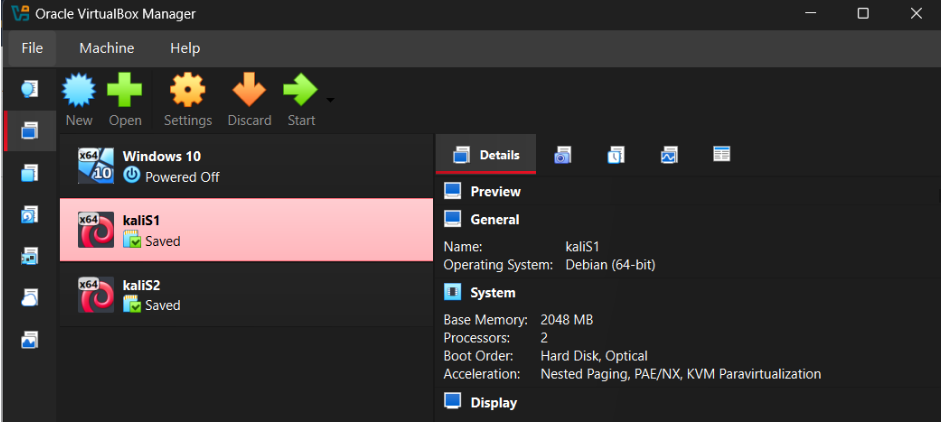

# Phase 1.1 – Lab Architecture

## Objective
Design and deploy a controlled internal lab environment that mirrors
basic enterprise network segmentation and host roles, enabling safe
security testing and observation.

---

## Environment Overview

| Component | Description |
|---------|-------------|
| Host OS | Windows |
| Hypervisor | VirtualBox |
| Network Type | Internal Network |
| Network Purpose | Isolated attacker–target communication |

---

## Systems Deployed

### Attacker System
- OS: Kali Linux
- Role: Simulated internal attacker
- Function: Traffic generation, enumeration, and testing

### Target System
- OS: Linux Virtual Machine
- Role: Internal asset
- Function: Service hosting and firewall enforcement

---

This phase documents the engineering setup of a controlled enterprise-style lab using VirtualBox. A single Kali Linux baseline VM was created and treated as a golden image, then cloned to produce multiple instances. The cloning process initially introduced identity duplication (MAC address and machine identity), which was identified and corrected to ensure proper Layer-2 uniqueness and accurate attribution.

Each VM was configured as a dual-homed host, with one adapter connected to NAT for controlled internet access and a second adapter connected to an Internal Network (corp-net) to simulate an isolated enterprise LAN. A host-managed DHCP server was deployed to provide IPv4 addressing within the internal subnet, enabling reliable attacker–victim communication without external exposure.

Troubleshooting focused on DHCP lease failures and NetworkManager behavior preserved during cloning. Stale connection profiles were removed, interfaces were re-managed, and networking services were restarted to restore correct DHCP operation. The final environment provides clean traffic separation, controlled connectivity, and a stable foundation for subsequent phases involving service exposure, enumeration, and detection engineering.

---

## Supporting Documentation

📄 **Detailed architecture report (PDF):**  
[Phase 1 – Lab Architecture (PDF)][phase1-architecture.pdf](https://github.com/user-attachments/files/24524691/phase1-architecture.pdf)

## Supporting Artifacts

 

![Dual Adapter Virtual Network]

